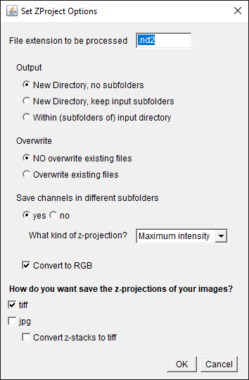

# ImageJ/Fiji Script Toolbox

This is a collection of `Python`/`Jython` scripts to automate image processing.

# `ZProject.py`

This script uses the [Bioformats](https://www.openmicroscopy.org/bio-formats/) plugin to read proprietary microscopy image formats into ImageJ.
If the input image contains several channels, they will be split into several files and the channel name will be added to the filename.
A z-projection will be obtained and saved.
Additionally, a txt file with the voxel sizes for each output image is created.

First, set the extension of the image files from the microscopy software, e.g. `nd2`.
The output can be in a new folder without subfolders (*recommended*) or the input directory tree can be recreated in the output folder.
Be aware, that if the filenames between subfolders are equal, the images will get overwritten or not processed, depending on the next option. **Best practice is to use unique filenames.**
Alternatively, the output files can be written within the subfolders of the input directory.  
The channels of the input image are split into single files which can be separated in subfolders (*recommended*).  
Choose the methods for the z-projection.
Tick the box if the images need to be converted to RGB (e.g. for processing in Angiotool).
Select the file format to save the z-projections (both `.tiff` and `.jpg` can be selected).
Tick the last option if you would like to save `.tiff` files of the z-stack images.
